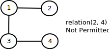
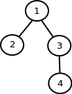

# 1.5 Case Study: Union-Find {#1-5-case-study-union-find}

In this case, we actually deal with graph representation. We used array to store each Vertex and dynamically create an edge using function **relation\(p, q\) ** that will update value of one of them. This case called as Union-Find because we need to find corresponding vertex for each p and q, then did merge or union operation. Kind or graph which will be built is **undirected graph** and followed **transitive** rule to define vertex connectivity. Transitive rule is, if p connected to q and q connected to r, then p connected to r. An image below demonstrate transitive rule:

Since vertex \(2, 4\) could connected through path 2-1-3-4, then we avoided to connecting \(2, 4\) directly. The final result of union\(\) operation is a tree with a root. A path in image above may represented as a **rooted tree** in image below:

There are five algorithm that used to implement Union-Find, detail of each algorithm will described later:

| Algorithm | Preprocessing | Union | Find |
| :---: | :---: | :---: | :---: |
| Quick-Find | N | N | 1 |
| Quick-Union | N | 1 | Tree height |
| Weighted Quick-Union | N | lg N | lg N |
| Weighted Quick-Union with Path Compression | N | O\(1\) | O\(1\) |

