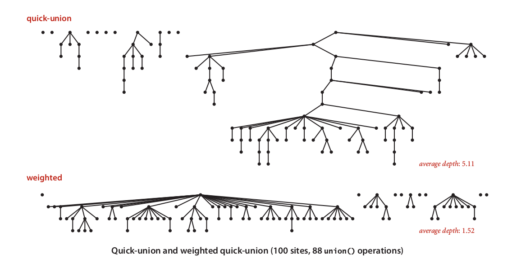

## Weighted Quick Union {#weighted-quick-union}

Quick-Union offer faster union operation, but find operation has strong correlation with tree height. This means, we need to avoiding build very height tree representation. To do that, we just need very small tweak of Quick-Union algorithm. Rather than just connection tree in the left to another tree in the right, we need to evaluate better connectivity by always connecting smaller tree into bigger tree. Take a look for table below:

| p | q |  | 0 | 1 | 2 | 3 | 4 | 5 | 6 | 7 | 8 | 9 |
| --- | --- | --- | --- | --- | --- | --- | --- | --- | --- | --- | --- | --- |
| 5 | 9 |  | 1 | 1 | 1 | 8 | 8 | 0 | 1 | 1 | 8 | 8 |
| **FIND** |  |  | - | 1 |  |  |  | - |  |  | 8 | - |
| **UNION** |  |  |  |  |  |  |  |  |  |  | 1 |   |

Right tree of root 8 smaller that left tree of root 1, then we need to decided that right tree should be connected as child of left tree.

Weighted Quick-Union amazingly best algorithm so far in practice. The experiment using 100 vertex proof that weighted scheme offered better union performance.

